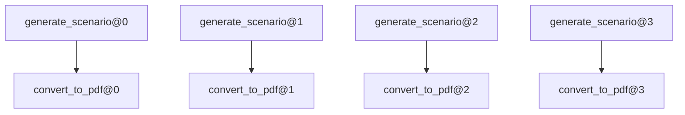

```mermaid
flowchart TD
	node1["convert_to_pdf@0"]
	node2["generate_scenario@0"]
	node2-->node1
	node3["convert_to_pdf@1"]
	node4["generate_scenario@1"]
	node4-->node3
	node5["convert_to_pdf@2"]
	node6["generate_scenario@2"]
	node6-->node5
	node7["convert_to_pdf@3"]
	node8["generate_scenario@3"]
	node8-->node7
```
