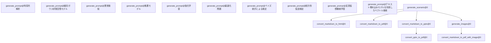

```mermaid
flowchart TD
	node1["generate_prompt@時系列解析"]
	node2["generate_prompt@線形ガウス状態空間モデル"]
	node3["generate_prompt@異常検知"]
	node4["generate_prompt@推薦モデル"]
	node5["generate_prompt@強化学習"]
	node6["generate_prompt@最適化問題"]
	node7["generate_prompt@ベイズ統計による検定"]
	node8["generate_prompt@統計的仮説検定"]
	node9["generate_prompt@反実仮想機械学習"]
	node10["generate_prompt@テキスト埋め込みモデルを利用したベクトル検索"]
	node11["convert_markdown_to_html@0"]
	node12["convert_markdown_to_pdf@0"]
	node13["convert_markdown_to_pdf_with_image@0"]
	node14["convert_markdown_to_pptx@0"]
	node15["convert_pptx_to_pdf@0"]
	node16["generate_images@0"]
	node17["generate_scenario@0"]
	node14-->node15
	node16-->node13
	node17-->node11
	node17-->node12
	node17-->node14
	node17-->node16
```
