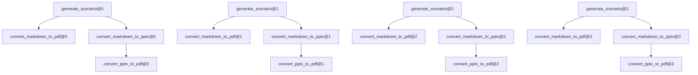

```mermaid
flowchart TD
	node1["convert_markdown_to_pdf@0"]
	node2["convert_markdown_to_pptx@0"]
	node3["convert_pptx_to_pdf@0"]
	node4["generate_scenario@0"]
	node2-->node3
	node4-->node1
	node4-->node2
	node5["convert_markdown_to_pdf@1"]
	node6["convert_markdown_to_pptx@1"]
	node7["convert_pptx_to_pdf@1"]
	node8["generate_scenario@1"]
	node6-->node7
	node8-->node5
	node8-->node6
	node9["convert_markdown_to_pdf@2"]
	node10["convert_markdown_to_pptx@2"]
	node11["convert_pptx_to_pdf@2"]
	node12["generate_scenario@2"]
	node10-->node11
	node12-->node9
	node12-->node10
	node13["convert_markdown_to_pdf@3"]
	node14["convert_markdown_to_pptx@3"]
	node15["convert_pptx_to_pdf@3"]
	node16["generate_scenario@3"]
	node14-->node15
	node16-->node13
	node16-->node14
```
