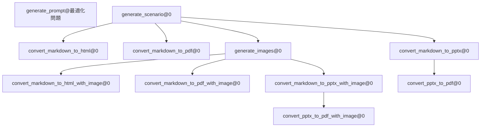

```mermaid
flowchart TD
	node1["generate_prompt@最適化問題"]
	node2["convert_markdown_to_html@0"]
	node3["convert_markdown_to_html_with_image@0"]
	node4["convert_markdown_to_pdf@0"]
	node5["convert_markdown_to_pdf_with_image@0"]
	node6["convert_markdown_to_pptx@0"]
	node7["convert_markdown_to_pptx_with_image@0"]
	node8["convert_pptx_to_pdf@0"]
	node9["convert_pptx_to_pdf_with_image@0"]
	node10["generate_images@0"]
	node11["generate_scenario@0"]
	node6-->node8
	node7-->node9
	node10-->node3
	node10-->node5
	node10-->node7
	node11-->node2
	node11-->node4
	node11-->node6
	node11-->node10
```
