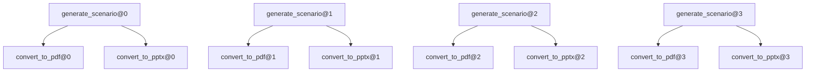

```mermaid
flowchart TD
	node1["convert_to_pdf@0"]
	node2["convert_to_pptx@0"]
	node3["generate_scenario@0"]
	node3-->node1
	node3-->node2
	node4["convert_to_pdf@1"]
	node5["convert_to_pptx@1"]
	node6["generate_scenario@1"]
	node6-->node4
	node6-->node5
	node7["convert_to_pdf@2"]
	node8["convert_to_pptx@2"]
	node9["generate_scenario@2"]
	node9-->node7
	node9-->node8
	node10["convert_to_pdf@3"]
	node11["convert_to_pptx@3"]
	node12["generate_scenario@3"]
	node12-->node10
	node12-->node11
```
