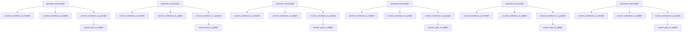

```mermaid
flowchart TD
	node1["convert_markdown_to_html@0"]
	node2["convert_markdown_to_pdf@0"]
	node3["convert_markdown_to_pptx@0"]
	node4["convert_pptx_to_pdf@0"]
	node5["generate_scenario@0"]
	node3-->node4
	node5-->node1
	node5-->node2
	node5-->node3
	node6["convert_markdown_to_html@1"]
	node7["convert_markdown_to_pdf@1"]
	node8["convert_markdown_to_pptx@1"]
	node9["convert_pptx_to_pdf@1"]
	node10["generate_scenario@1"]
	node8-->node9
	node10-->node6
	node10-->node7
	node10-->node8
	node11["convert_markdown_to_html@2"]
	node12["convert_markdown_to_pdf@2"]
	node13["convert_markdown_to_pptx@2"]
	node14["convert_pptx_to_pdf@2"]
	node15["generate_scenario@2"]
	node13-->node14
	node15-->node11
	node15-->node12
	node15-->node13
	node16["convert_markdown_to_html@3"]
	node17["convert_markdown_to_pdf@3"]
	node18["convert_markdown_to_pptx@3"]
	node19["convert_pptx_to_pdf@3"]
	node20["generate_scenario@3"]
	node18-->node19
	node20-->node16
	node20-->node17
	node20-->node18
	node21["convert_markdown_to_html@4"]
	node22["convert_markdown_to_pdf@4"]
	node23["convert_markdown_to_pptx@4"]
	node24["convert_pptx_to_pdf@4"]
	node25["generate_scenario@4"]
	node23-->node24
	node25-->node21
	node25-->node22
	node25-->node23
	node26["convert_markdown_to_html@5"]
	node27["convert_markdown_to_pdf@5"]
	node28["convert_markdown_to_pptx@5"]
	node29["convert_pptx_to_pdf@5"]
	node30["generate_scenario@5"]
	node28-->node29
	node30-->node26
	node30-->node27
	node30-->node28
```
